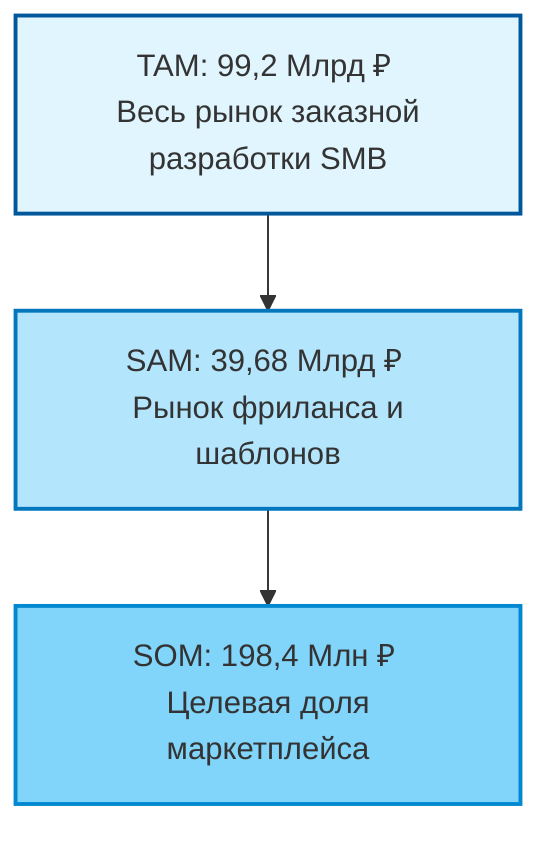

# Market Research: Маркетплейс незавершенных IT-активов

## 1. Проблематика и контекст (Problem Statement)

### 1.1. Феномен «Мертвого кода» (Dead Code)
Ежегодно в российском IT-секторе генерируется значительный объем интеллектуальной собственности, которая не капитализируется. Это формирует проблему потери времени для разработчиков и проблему повторного написания кода для бизнеса, который уже был до этого написан.

*   **Контекст:** По данным ФРИИ, более **90% стартапов** на стадии pre-seed прекращают деятельность в первые 12 месяцев.
*   **Разрыв:** Разработчики рассматривают недоделанный код как актив с нулевой ликвидностью. Покупатели избегают вторичного кода из-за высокой стоимости повторной проверки бизнеса — технический аудит стороннего репозитория зачастую превышает стоимость самого актива.
*   **Экономический эффект:** Тысячи человеко-часов расходуются на переписывание стандартных модулей (бойлерплейты, CRM, маркетплейсы), которые уже существуют в заброшенных репозиториях.

### 1.2. Валидация проблемы (Метрики)

| Метрика | Значение | Обоснование / Прокси-данные |
| :--- | :--- | :--- |
| **Failure Rate (Стартапы)** | ~92% (РФ) | *Startup Barometer 2024/2025 (ФРИИ)* |
| **Рост стоимости разработки** | +18-25% YoY | *Хабр Карьера (Зарплатный отчет)* |
| **Стоимость аудита (ручной)** | 50 000 - 150 000 ₽ | Средняя ставка Senior-разработчика за ревью архитектуры |
| **Утилизация активов** | < 1% | Оценочная доля повторного использования кода из закрытых проектов |

---

## 2. Сегментация клиентов

Рынок делится на поставщиков и потребителей. Фокус на секторе **B2B / Pro-sumer**.

### 2.1. Таблица сегментов

| Параметр | Покупатель | Продавец |
| :--- | :--- | :--- |
| **Сегмент** | **«Охотники за скоростью»** | **«Разочарованные Инди»** |
| **Профиль** | Малые веб-студии, серийные предприниматели, No-code агентства. | Junior/Middle разработчики, фаундеры закрывшихся стартапов. |
| **Потребность** | *«Когда мне нужно запустить MVP с ограниченным бюджетом, я хочу купить готовую кодовую базу (backend + frontend), чтобы сократить срок разработки с 4 месяцев до 2 недель».* | *«Я хочу вернуть хотя бы часть вложенных ресурсов (времени/денег) за проект, который я больше не буду развивать».* |
| **Барьеры** | Риск покупки спагетти-кода, скрытые баги, отсутствие документации. | Отсутствие площадки, сложность предпродажной подготовки. |

### 2.2. Value Proposition (Ценностное предложение)
*   **Для покупателя:** Снижение Time-to-Market на 70% + гарантия качества через автоматизированный AI-аудит.
*   **Для продавца:** Монетизация неликвидного актива + безопасная сделка.

---

## 3. Оценка рынка (TAM/SAM/SOM)

**Методология:** Комбинированный подход.
*   *Top-Down:* На основе объема рынка заказной разработки ПО в РФ.
*   *Bottom-Up:* На основе среднего чека фриланс-сделок и объема рынка Low-budget разработки.

### 3.1. Количественная оценка рынка в РФ

| Уровень рынка | Оценка (RUB) | Определение и допущения |
| :--- | :--- | :--- |
| **TAM**  (Total Addressable Market) | **99,2 Млрд ₽** | Общий объем рынка заказной веб и мобильной разработки для сегмента МСБ (SMB) в РФ.  *Исключен Enterprise/Gov сектор.* |
| **SAM**  (Serviceable Available Market) | **39,68 Млрд ₽** | Рынок «Low-End» и фриланса. Включает бюджеты, расходуемые сейчас на биржах (Kwork, FL, Habr Freelance), покупку шаблонов и доработку скриптов. |
| **SOM**  (Serviceable Obtainable Market) | **198,4 Млн ₽** | **Цель: 1.5% от SAM за 3 года.**  Достижимая доля рынка при текущих ресурсах и каналах привлечения. |

### 3.2. Логика расчета SOM (Bottom-Up)
*   **Целевое кол-во сделок: ~22 000 сделок в год (на 3-й год работы).
*   **Средний чек (AOV): 30 000 ₽ (разработка MVP / модуля).
*   **Годовая выручка платформы: 198 400 000 ₽, что соответствует 0,5% доступного рынка (SAM).
*   **Расчет GMV: 22 000 × 30 000 ₽ = 660 000 000 ₽ оборота.

### 3.3. Визуализация (Mermaid Chart)

---

## 4. Драйверы роста (Why Now)

Реализуемость бизнес-модели обеспечивается тремя макро-факторами на горизонте 2025–2026 гг.:

1.  **AI-Driven Audit (Технологический драйвер):**
    *   *Суть:* LLM (GPT-4/Claude) позволяют проводить глубокий статический анализ кода и оценку архитектурной сложности за $0.1–0.5.
    *   *Влияние:* Радикальное снижение транзакционных издержек. Ранее аудит делал покупку дешевого кода нерентабельной.

2.  **Дефицит кадров (Экономический драйвер):**
    *   *Суть:* Рост зарплат разработчиков (Middle/Senior) в РФ делает разработку «с нуля» недоступной для микро-бизнеса.
    *   *Влияние:* Сдвиг спроса в сторону готовых решений.

3.  **Импортозамещение:**
    *   *Суть:* Уход западных SaaS-вендоров стимулирует массовое создание локальных аналогов.
    *   *Влияние:* Высокая потребность в быстрых запусках аналогов на базе готовых компонентов.

---

## 5. Источники данных (References)

При подготовке исследования использовались следующие источники и отчеты:

1.  **РАЭК (Российская Ассоциация Электронных Коммуникаций):** Отчет «Экономика Рунета 2024-2025» (Сектор цифровых услуг).
2.  **Russoft (Руссофт):** Ежегодное исследование индустрии разработки ПО в России (Объем внутреннего рынка).
3.  **IIDF (ФРИИ):** Исследование «Стартап-барометр» (Метрики выживаемости проектов ранних стадий).
4.  **Habr Career / Хабр Карьера:** Аналитика зарплат IT-специалистов (Обоснование роста себестоимости разработки).
5.  **Data Insight / TAdviser:** Обзоры рынка электронной коммерции и заказной разработки.
6.  **TAdviser — рынок IT-услуг и цифровой разработки в России  https://tadviser.com/index.php/Article:IT_Services_(Russian_Market)
7.  **Mordor Intelligence — Russia ICT Market  https://www.mordorintelligence.com/industry-reports/russia-ict-market

**Проект:** Маркетплейс «мертвого кода» (Dead Code Marketplace) с AI-аудитом.
**Рынок:** РФ.
**Суть:** Платформа, где разработчики и студии продают неиспользуемые, «замороженные» или пет-проекты, а покупатели получают проверенную AI-агентами кодовую базу для ускорения своей разработки.

---

### Шаг 2. Углубление конкурентного анализа

Ниже представлена матрица конкурентов и альтернативных решений (6 ключевых + 1 инерционный сценарий), актуальных для российского рынка на текущий момент.

#### Таблица конкурентов/альтернатив

| Название / Тип решения | Тип конкурента | Целевой сегмент | Ценностный тезис (Что обещают) | Сильные стороны | Слабые стороны / Ограничения | Монетизация |
| :--- | :--- | :--- | :--- | :--- | :--- | :--- |
| **Kwork (Раздел «Скрипты и боты»)** | **Прямой (местный)** | Фрилансеры, малый бизнес, веб-мастера. | «Магазин готовых решений: купи скрипт за 500 рублей и сэкономь время». | 1. Огромный трафик в РФ. 2. Привычная схема безопасной сделки. 3. Низкий порог входа. | 1. **Низкое качество кода** (кот в мешке). 2. Отсутствие тех. аудита (ручная модерация только описаний). 3. Часто продают паблик/ворованный код. | Комиссия платформы (~20%). |
| **Infostart (Инфостарт)** | **Прямой (нишевый)** | 1С-разработчики, бухгалтеры, интеграторы. | «Крупнейшее сообщество и маркетплейс разработок для 1С». | 1. Высокое доверие и экспертность. 2. Есть система рейтингов и проверки. 3. Огромная база готовых модулей. | 1. Узкая ниша (только 1С). 2. Сложная система внутренней валюты ($m). 3. Устаревший UI/UX. | Подписка (абонемент) + продажа за внутреннюю валюту. |
| **GitHub / GitLab (Open Source)** | **Косвенный / Замена** | Все разработчики. | «Бесплатный код для всех. Совместная разработка». | 1. Бесплатно. 2. Мировой стандарт. 3. Видна история изменений. | 1. Требует времени на поиск и проверку. 2. Нет гарантий работоспособности. 3. Лицензионные ограничения (не всё можно в коммерцию). | Бесплатно (для public). |
| **Telderi (Биржа сайтов)** | **Косвенный** | Веб-мастера, инвесторы в сайты. | «Безопасная покупка и продажа сайтов и доменов». | 1. Лидер рынка купли-продажи IT-активов в РФ. 2. Проработанный юридический трансфер прав. | 1. Продают готовый бизнес/трафик, а не чистый код. 2. Высокие чеки. 3. Код часто «легаси» и плохого качества. | Комиссия со сделки. |
| **Envato Market (CodeCanyon)** | **Прямой (Глобальный)** | Веб-студии, разработчики CMS. | «Тысячи скриптов и плагинов от лучших разработчиков мира». | 1. Эталонный ассортимент. 2. Жесткая модерация качества. 3. Хорошая документация. | 1. **Сложности с оплатой из РФ.** 2. Языковой барьер. 3. Высокая конкуренция для продавцов. | Комиссия с продаж (до 50%). |
| **Генеративный AI (ChatGPT, Copilot, DeepSeek)** | **Замена (Технологическая)** | Разработчики л��бого уровня. | «Напишу код с нуля под твою задачу за секунды». | 1. Мгновенный результат. 2. Кастомизация под запрос. 3. Не нужно разбираться в чужой архитектуре. | 1. Пишет фрагменты, а не сложные системы целиком. 2. Галлюцинации и баги. 3. Ограничен контекстным окном (сложно сгенерировать большой проект сразу). | Подписка. |
| **Hard Drive Graveyard (Инерция)** | **Замена (Поведенческая)** | Разработчики с пет-проектами. | «Пусть лежит, вдруг пригодится (или лень выкладывать)». | 1. Ноль усилий. 2. Чувство обладания «интеллектуальной собственностью». | 1. Код устаревает и теряет ценность. 2. Не приносит денег. 3. Занимает место (ментальное и дисковое). | Отсутствует (упущенная выгода). |

---

#### Выводы по Шагу 2: «Окна возможностей»

На основе анализа матрицы выявлены следующие зоны, где конкуренты слабы, а ваше решение (AI-аудит + РФ рынок) имеет потенциал:

1.  **Проблема качества ("Кот в мешке"):**
    *   *Ситуация:* На Kwork и в Telegram-чатах качество кода низкое и никем не гарантировано. Open Source требует долгого ревью.
    *   *Возможность:* **AI-аудит (Quality Gate).** Автоматическое формирование техпаспорта кода (чистота, безопасность, сложность внедрения) создаст доверие, которого нет у дешевых аналогов.

2.  **Проблема монетизации "неликвида":**
    *   *Ситуация:* Продать недоделанный проект (MVP, который не взлетел) сейчас негде. Telderi требует трафик и доход, Kwork требует «коробочный продукт».
    *   *Возможность:* Позиционирование как **«Вторсырье кода»**. Продажа именно модулей, наработок и архитектуры, а не готового бизнеса.

3.  **Проблема доступа к международным базам:**
    *   *Ситуация:* Envato (CodeCanyon) фактически закрыт для прямой покупки/продажи из РФ без "танцев с бубном".
    *   *Возможность:* **Импортозамещение CodeCanyon** с фокусом на локальные платежные системы и юридическую чистоту для B2B (акты передачи прав).

4.  **Ограничение AI-генераторов:**
    *   *Ситуация:* ChatGPT пишет код, но не дает готовой архитектуры сложного проекта (SaaS, CRM).
    *   *Возможность:* Продавать **готовые "скелеты" (Boilerplates)** сложных систем, которые покупатель потом допилит через AI. Это быстрее, чем генерировать с нуля по кускам.

